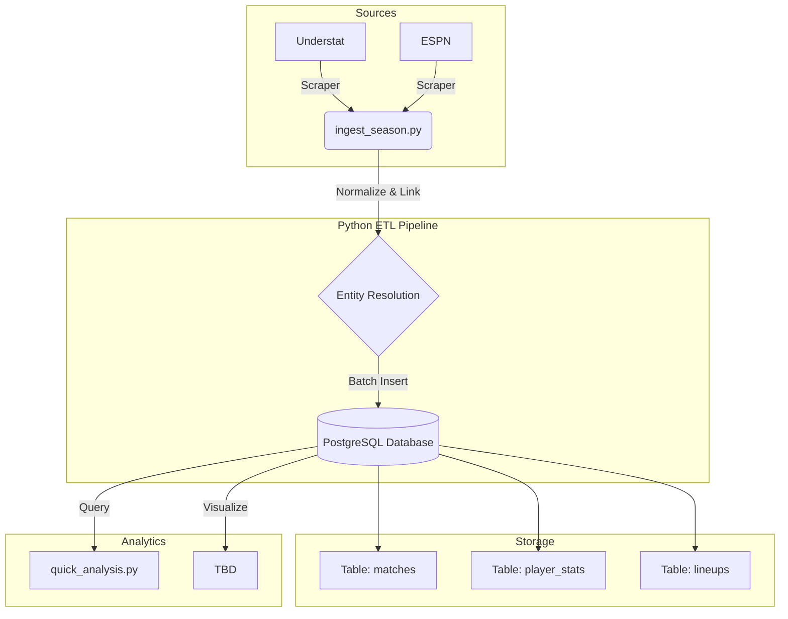

# Spanish Football Predictive Analytics

## Project Overview
This project is developed as part of the **Big Data Analytics** university course.

The goal is to build a high-performance predictive analytics engine for Spanish La Liga football matches. Unlike standard statistical models that rely on simple goals/assists, this project implements a robust **ETL (Extract, Transform, Load)** pipeline to fuse two distinct data layers:

1.  **The Engine (Statistical Layer):** Advanced metrics like Expected Goals (xG), xA, and xGChain from *Understat*.
2.  **The Context (Tactical Layer):** Starting lineups, player positions, and defensive actions from *ESPN*.

By merging these datasets into a normalized PostgreSQL warehouse, we aim to train predictive models that understand *context*—not just who scored, but who created the play and how tactical formations influence match outcomes.

## Architecture
The system follows a modern Data Warehousing architecture:

* **Ingestion:** Python-based scrapers (`soccerdata`) fetching raw data from multiple web sources.
* **Transformation:** Cleaning, normalization, and entity resolution (linking players across different sources).
* **Storage:** A relational **PostgreSQL** database with optimized schemas for analytical querying.

## Data Dictionary
The database consists of three core tables designed for granular analysis:

| Table | Description | Key Metrics | Source |
| :--- | :--- | :--- | :--- |
| `matches` | The central fact table for game metadata. | Date, Score, Aggregate xG | Understat |
| `player_stats` | Performance metrics for the "Engine". | xG, xA, xGChain, xGBuildup | Understat |
| `lineups` | Tactical context and defensive actions. | Positions, Fouls, Saves, Cards | ESPN |

## Tech Stack
* **Language:** Python 3.13
* **Database:** PostgreSQL 15+
* **Libraries:** `soccerdata`, `pandas`, `psycopg2`, `SQLAlchemy`
* **Environment:** Virtual Environment (venv) on macOS/Linux

## Installation & Setup
For detailed instructions on setting up the environment, installing dependencies, and initializing the database, please refer to the **[SETUP.md](SETUP.md)** file.

**Quick Start:**
1.  Install dependencies: `pip install -r requirements.txt`
2.  Initialize Database: `python reset_db.py`
3.  Ingest Data: `python ingest_season.py`

## Disclaimer
This project is for educational and research purposes only. Data scraping adheres to the `robots.txt` policies of the respective sources where applicable.

---
*Created by Lucas Avila for Big Data Analytics, 2026*